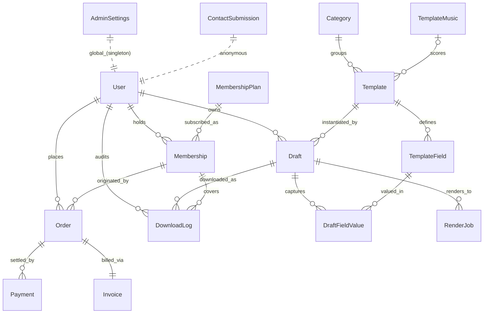

# Database Architecture — Stage 2

**Project:** My Invitations
**DB Engine:** PostgreSQL (Neon)
**ORM:** Prisma 5.22
**Status:** Schema designed. No migration, no connection, no seed in this stage.

> All amounts are stored in **paise (INR)** as `Int`. All timestamps are `DateTime` (Postgres `timestamptz`). All primary keys are `cuid()`.

---

## 1. ERD (Entity-Relationship Diagram)

---

## 2. Relationship Explanation

### Auth & Identity
- **User** is a Firebase-Auth mirror. `firebaseUid` and `email` are both unique. `role` separates `SUPER_ADMIN` from `USER`. `status` (`ACTIVE`/`BLOCKED`/`DELETED`) supports soft moderation/lifecycle without hard-delete.
- **AdminSettings** is a singleton (`id` defaults to `"default"`). Holds business / GST / support contact data used by Invoice generation and the public site.

### Catalogue
- **Category 1—* Template**: a template belongs to exactly one category. `ON DELETE RESTRICT` prevents accidental loss of templates when admins try to remove a category in use (admins must move templates first).
- **TemplateMusic 0..1—* Template**: optional. If a music track is removed, attached templates have their `musicId` set to `NULL` (`ON DELETE SET NULL`) so the template itself survives.
- **Template 1—* TemplateField**: dynamic field schema per template (e.g. `BRIDE_NAME`, `GROOM_NAME`, `EVENT_DATE`). `ON DELETE CASCADE` — removing a template removes its field definitions.

### Authoring
- **User 1—* Draft**: a user's working invitations. `ON DELETE CASCADE` from User; drafts disappear with the user.
- **Template 1—* Draft**: drafts reference a template. `ON DELETE RESTRICT` prevents removing a template that has live drafts; use the `ARCHIVED` status instead.
- **Draft 1—* DraftFieldValue 1—1 TemplateField**: filled values. Unique `(draftId, fieldId)` ensures one value per field per draft. Cascades on both sides.

### Commerce
- **MembershipPlan 1—* Membership**: catalog of plans (₹99/₹179/₹239 etc.). `ON DELETE RESTRICT` from plan to keep historical memberships intact.
- **User 1—* Membership**: **stackable**. No unique constraint on `(userId, status=ACTIVE)` — a user may hold multiple `ACTIVE` memberships at once. `downloadsUsed` is per-membership.
- **User 1—* Order**: purchase intents.
- **Order 0..1—1 Membership** (FK on Order, `@unique`): each order produces at most one membership, but the membership can have several orders associated (e.g. renewals) via the reverse relation. `ON DELETE SET NULL` from membership to preserve order history.
- **Order 1—* Payment**: Razorpay attempt log. One order can have multiple `PENDING` / `FAILED` payments before a `SUCCESS`. `ON DELETE RESTRICT` for audit.
- **Order 1—1 Invoice**: one invoice per order. Invoice snapshots business + bill-to + GST values at issuance so later edits to AdminSettings or User don't rewrite history.

### Fulfilment
- **Draft 1—* RenderJob**: each Remotion run is a row (preview / retry / final). `ON DELETE CASCADE` — jobs are tied to the draft.
- **DownloadLog**: append-only audit. Every download writes a row, increments `Membership.downloadsUsed` (application-side), and references `userId + draftId + membershipId`. Cascade from User (user wipe); Restrict from Draft and Membership (preserve audit).

### Public
- **ContactSubmission**: anonymous form. No FK to User.

---

## 3. Index Strategy

| Model | Indexes | Rationale |
|---|---|---|
| User | `role`, `status`, `createdAt`; unique `firebaseUid`, `email` | Admin lists, auth lookups, moderation filtering. |
| Category | `active`, `sortOrder`, `deletedAt`; unique `slug` | Public listing order + slug resolution. |
| TemplateMusic | `active`, `name` | Admin library filters. |
| Template | `categoryId`, `musicId`, `type`, `language`, `status`, `visibility`, `featured`, `trending`, `bestSeller`, `createdAt`, `deletedAt`; unique `slug` | Heavily filtered browse page (category × type × language × featured), SEO slug routing. |
| TemplateField | `templateId`, `sortOrder`; composite unique `(templateId, key)` | Render-time fetch ordered by `sortOrder`; per-template key uniqueness. |
| Draft | `userId`, `templateId`, `status`, `createdAt`, `deletedAt` | "My drafts" view, admin template-usage analytics. |
| DraftFieldValue | `draftId`, `fieldId`; composite unique `(draftId, fieldId)` | Bulk-load values for a draft; integrity on one-value-per-field. |
| MembershipPlan | `active`, `sortOrder`, `deletedAt` | Pricing page ordering. |
| Membership | `userId`, `planId`, `status`, `endDate`, composite `(userId, status)` | "Do I have an active membership?" hot-path; daily expiry sweep on `endDate`. |
| Order | `userId`, `status`, `createdAt`; unique `membershipId` | User order history, daily reconciliation, 1—1 membership link. |
| Payment | `orderId`, `status`, `razorpayOrderId`, `createdAt`; unique `razorpayPaymentId` | Webhook idempotency on `razorpayPaymentId`, reconciliation on `razorpayOrderId`. |
| Invoice | `status`, `issuedAt`; unique `orderId`, `invoiceNumber` | GST month/year report queries; idempotent invoice fetch. |
| DownloadLog | `userId`, `draftId`, `membershipId`, `downloadedAt`, composite `(userId, downloadedAt)` | Per-user download history, usage analytics, rate-limit windows. |
| RenderJob | `draftId`, `status`, `createdAt` | Worker queue scans on `status=PENDING`, retry/observability. |
| ContactSubmission | `email`, `createdAt` | Admin inbox sorting & spam dedupe by email. |

---

## 4. Constraint Strategy

### Unique
- `User.firebaseUid`, `User.email`
- `Category.slug`
- `Template.slug`
- `TemplateField (templateId, key)` — same dynamic key can repeat across templates but not within one template
- `DraftFieldValue (draftId, fieldId)` — at most one value per field per draft
- `Order.membershipId` — one order per membership at most
- `Payment.razorpayPaymentId` — webhook idempotency
- `Invoice.orderId`, `Invoice.invoiceNumber`

### Foreign-Key Cascade Matrix

| Child → Parent | onDelete | Reason |
|---|---|---|
| Draft → User | `CASCADE` | A deleted user's drafts have no meaning. |
| Draft → Template | `RESTRICT` | Use `ARCHIVED` status; never silently drop drafts. |
| DraftFieldValue → Draft | `CASCADE` | Values are part of the draft aggregate. |
| DraftFieldValue → TemplateField | `CASCADE` | If a field definition is removed, stored values are invalid. |
| TemplateField → Template | `CASCADE` | Field schema is owned by the template. |
| Template → Category | `RESTRICT` | Force admin to migrate templates first. |
| Template → TemplateMusic | `SET NULL` | Template survives music removal. |
| Membership → User | `RESTRICT` | Preserve financial / GST history. |
| Membership → MembershipPlan | `RESTRICT` | Preserve plan terms at purchase. |
| Order → User | `RESTRICT` | Preserve order/invoice history. |
| Order → Membership | `SET NULL` | Order record survives orphaned membership. |
| Payment → Order | `RESTRICT` | Payments are immutable audit. |
| Invoice → Order | `RESTRICT` | Invoices are immutable audit. |
| DownloadLog → User | `CASCADE` | Logs go with user wipe. |
| DownloadLog → Draft | `RESTRICT` | Logs outlive draft removal attempts (drafts soft-delete). |
| DownloadLog → Membership | `RESTRICT` | Memberships are not hard-deletable while referenced. |
| RenderJob → Draft | `CASCADE` | Jobs are owned by their draft. |

### Soft-delete (`deletedAt`)
Added on `User`, `Category`, `Template`, `Draft`, `MembershipPlan`. Indexed for cheap filtering.

### Defaults
- All `createdAt` default `now()`; all `updatedAt` use `@updatedAt`.
- Boolean flags (`active`, `featured`, `trending`, `bestSeller`) default `false`/`true` to safe values.
- Enum defaults: `User.role=USER`, `User.status=ACTIVE`, `Template.status=DRAFT`, `Template.visibility=PUBLIC`, `Membership.status=ACTIVE`, `Order.status=PENDING`, `Payment.status=PENDING`, `Invoice.status=GENERATED`, `RenderJob.status=PENDING`, `Template.language=EN`.

---

## 5. Scalability Notes

1. **Money in paise (Int)** — Postgres `INTEGER` is 4 bytes and fits up to ₹21,474,836.47, more than sufficient for invoice totals. Avoids `DECIMAL` rounding bugs.
2. **Stackable memberships** — Architecture allows multiple `ACTIVE` rows per user. Effective limit-checks aggregate `downloadsUsed` vs `downloadLimit` across all currently-valid memberships in the application layer (not in the DB). This keeps the schema simple and lets pricing/policy evolve without migrations.
3. **Webhook idempotency** — `Payment.razorpayPaymentId` is `UNIQUE`, allowing safe upserts when Razorpay re-delivers webhooks.
4. **Invoice snapshotting** — Bill-to and seller GST fields are denormalised onto `Invoice`. Later edits to `AdminSettings` or `User` never mutate historical PDFs.
5. **Append-only DownloadLog** — Never updated, only inserted. Composite index `(userId, downloadedAt)` supports fast windowed queries (e.g. "downloads in the last 24h"). High-volume; can be partitioned by month later (Postgres declarative partitioning) without schema redesign.
6. **Render queue** — `RenderJob.status` indexed; workers `SELECT … WHERE status='PENDING' ORDER BY createdAt LIMIT N FOR UPDATE SKIP LOCKED` for safe concurrent draining.
7. **Soft-delete + indexes on `deletedAt`** allow `WHERE deletedAt IS NULL` to remain index-assisted at scale.
8. **Mobile-app ready** — `id`s are `cuid()` strings (URL-safe), enabling offline draft creation by clients and conflict-free sync (clients can mint IDs locally).
9. **Tenancy** — Single-tenant. If multi-tenant ever required, add a `tenantId` column to top-level models and a partial unique index per tenant.
10. **Read replicas** — All hot reads (`/templates`, `/drafts`, membership checks) hit indexed columns; suitable for Neon read-replica routing without app changes.

---

## 6. Out of Scope for Stage 2 (Reminder)

- ❌ No `prisma migrate` run.
- ❌ No `prisma db push` run.
- ❌ No seed data.
- ❌ No DB connection from app code.
- ❌ No repositories / services / APIs / pages / auth / payments / rendering integration.

These resume in subsequent stages upon explicit approval.
